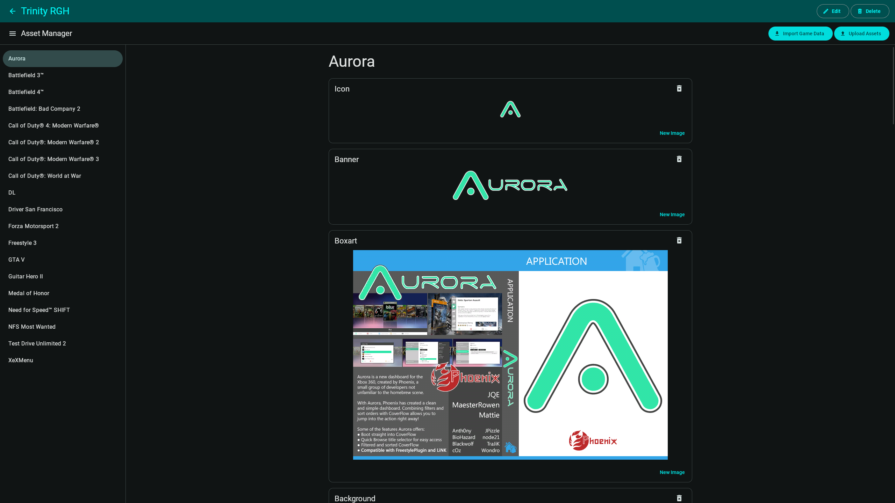
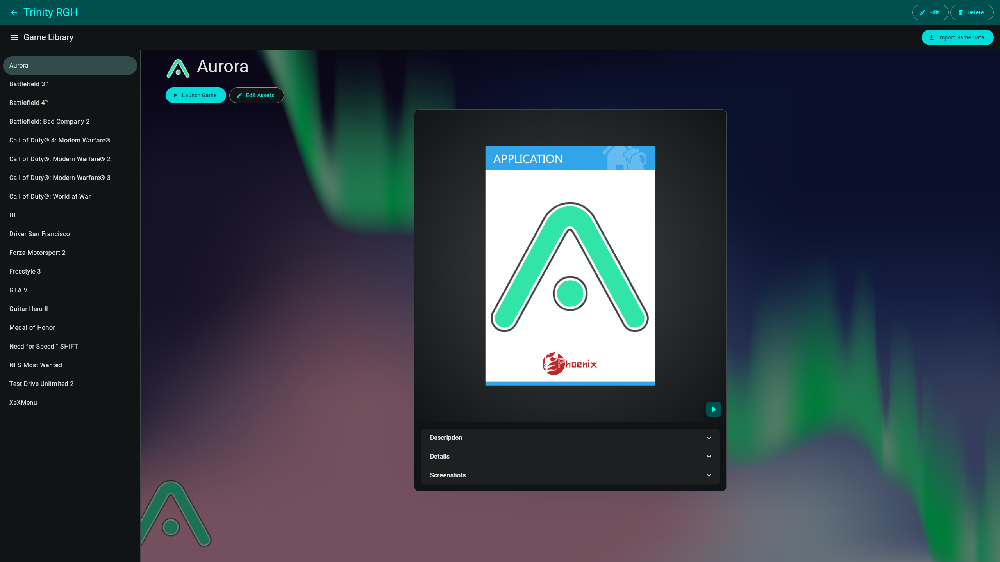
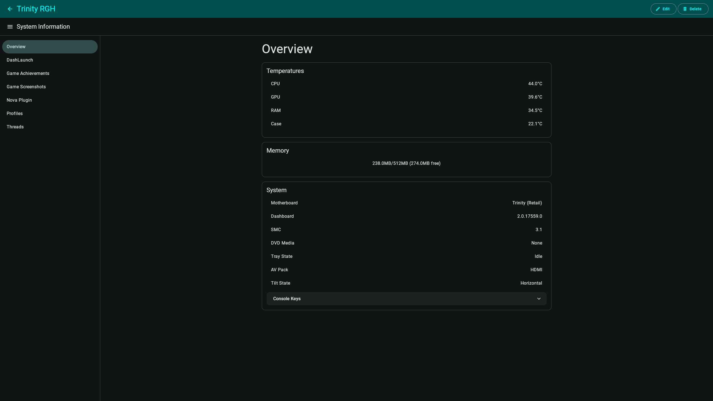
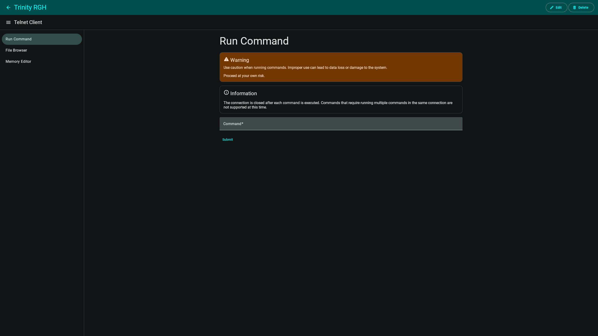

# Australis

A client for the Aurora Xbox 360 Dashboard.

## Features

### Asset Manager

- Set an asset image from a local file, the Xbox Catalog, or Xbox Unity
- Import game data from console
- Upload assets to console

 
View screenshot

### Game Library

- Cards featuring interactive 3D cover art, a description, details, and screenshots for the game
- Launch the game on the console
- Manage artwork
- Import game data from console

  
View screenshot

### System Information

- Live temperature, memory (RAM) usage, and console information
- Information about DashLaunch configuration
- View achievements for the currently running game
- View, create, and delete screenshots for currently running game
- Information about the Nova plugin
- See currently signed in profile information
- Live thread information with ability to suspend or resume main thread

  
View screenshot

### Telnet Client

- Run telnet commands
- Navigate the file structure and launch executables
- View and edit memory values

  
View screenshot

## Changelog

For a list of changes between releases see [CHANGELOG.md](./CHANGELOG.md).

## License

Australis is licensed under GPLv3 or later. For more information see [COPYING](./COPYING).
